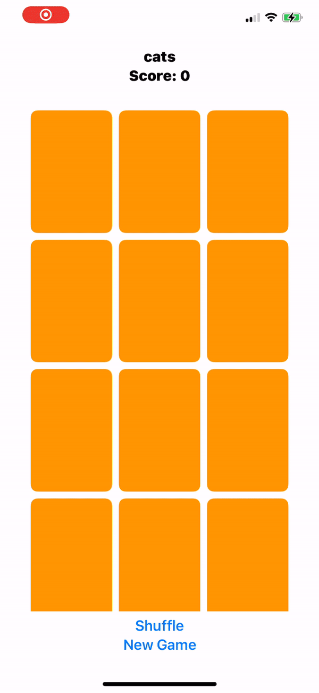
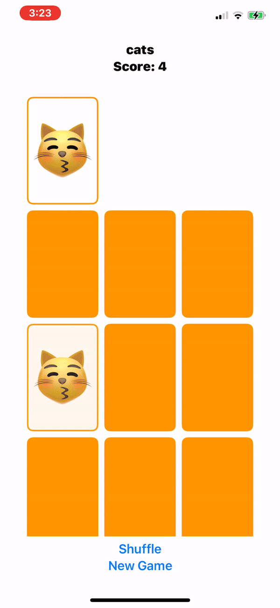

# 🃏 Stanford CS193p Card Game Project

Welcome to my implementation of the **Card-Matching Game**, inspired by Stanford's renowned **CS193p iOS Development** course (2023 edition). This project reflects the culmination of lessons from **Lectures 1–6**, showcasing best practices in modern iOS development with **SwiftUI** and **MVVM architecture**. 🎉

---

## 🛠️ How to Run the Project

Follow these steps to clone and run the Card Game project locally:

1. **Clone the Repository**:
   Open your terminal and run:
   ```bash
   git clone git@github.com:acalderon20/Stanford193p.git
   cd Stanford193p
   open Stanford193p.xcodeproj
   
---

## 🌟 Features

- **🎮 Card Matching Gameplay**  
   Tap to reveal cards and match pairs while enjoying dynamic animations.
- **🎨 Thematic Customization**  
   Switch between engaging themes for a fresh new look.
- **🔄 Shuffle & Reset**  
   Shuffle the cards or start a new game for endless replayability.
- **📱 Responsive Design**  
   Optimized UI for seamless performance across all device sizes.
- **⚡ Smooth Animations**  
   User-friendly transitions powered by SwiftUI animation modifiers.

---

## 🛠️ Key Skills & Concepts

This project demonstrates my expertise in the following:

### **🚀 SwiftUI**
- Declarative UI creation for clean and maintainable code.
- Advanced layout management using `ZStack`, `HStack`, and `LazyVGrid`.

### **📐 MVVM Architecture**
- Clear separation of concerns into **Model**, **View**, and **ViewModel** layers.
- Efficient state management using `@State`, `@Binding`, and `@ObservedObject`.

### **🧩 Protocol-Oriented Programming**
- Modular and reusable code with protocols and generics.
- Adherence to single-responsibility principles for scalable solutions.

### **🧮 Functional Programming**
- Immutability and pure functions for clean data handling.
- Utilization of Swift’s `map`, `filter`, and `reduce` functions for logic simplification.

### **🎞️ Animation**
- Interactive user experiences with SwiftUI’s built-in animation tools.

---

## 🎯 How It Works

1. **Objective**: Match pairs of cards by tapping them to reveal their contents.  
2. **Themes**: Enjoy different card symbols and colors with thematic customization.  
3. **Scoring**: Gain points for correct matches; lose points for mismatches.  
4. **Shuffle & Reset**: Refresh the game with the shuffle or new game options.

---

## ⚙️ Technologies Used

- **SwiftUI**: For declarative UI and dynamic interfaces.  
- **Combine Framework**: For state and data flow management.  
- **Xcode 15**: For development, testing, and debugging.

---

## 🎥 Demo

### Gameplay in Action  


### Shuffle & New Game Features  


---

## 🧠 What I Learned

By completing this project, I’ve gained a solid understanding of creating dynamic, user-centric iOS apps. This journey through **CS193p’s first six lectures** honed my skills in writing clean, maintainable, and testable code while mastering modern tools like SwiftUI and MVVM.

---

## 🙌 Acknowledgements

Special thanks to **Paul Hegarty** for his incredible course!!

---

### 📬 Let’s Connect!

Have questions or want to collaborate on iOS projects? Feel free to connect with me via:  
- **GitHub**: [My Profile](https://github.com/acalderon20)  
- **Upwork**: [Adolfo C. - iOS Developer](https://www.upwork.com/freelancers/~0175776b8126b85eac?mp_source=share)
